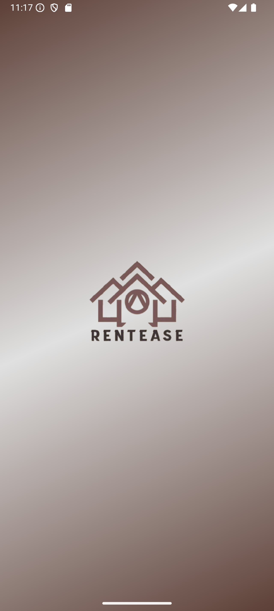

# RentEase - Student Housing Made Easy


## Overview

RentEase is a mobile application designed to bridge the gap between property owners and students/bachelors looking for rental accommodations. The platform provides a seamless experience for both property owners to list their rooms and seekers to find their perfect accommodation.

## Features

### For Property Owners

- Easy registration with email and phone verification
- Room listing with detailed information:
  - Location
  - Room size (1BHK, 2BHK, etc.)
  - Square footage
  - Room photos
  - Monthly rent
  - Minimum stay duration
  - Nearby amenities (stores, hospitals, etc.)
- Manage multiple property listings
- Track booking requests
- Secure payment collection

### For Room Seekers

- User-friendly registration process
- Location-based room search
- Advanced filtering options:
  - Price range
  - Room size
  - Amenities
  - Minimum stay duration
- Room booking with secure payment
- Save favorite listings
- View booking history

## Getting Started

### Prerequisites

- Flutter SDK (latest version)
- Android Studio / VS Code
- Firebase account
- Google Maps API key

### Installation

1. Clone the repository

```bash
https://github.com/A-MA9/RentEase.git
```

2. Install dependencies

```bash
cd rentease
flutter pub get
```

3. Run the app

```bash
flutter run
```

## Contact

Your Name - [@yourtwitter](https://twitter.com/yourtwitter)

Project Link: [https://github.com/yourusername/rentease](https://github.com/yourusername/rentease)

## Screenshots



---

Made with ❤️ by RentEase
